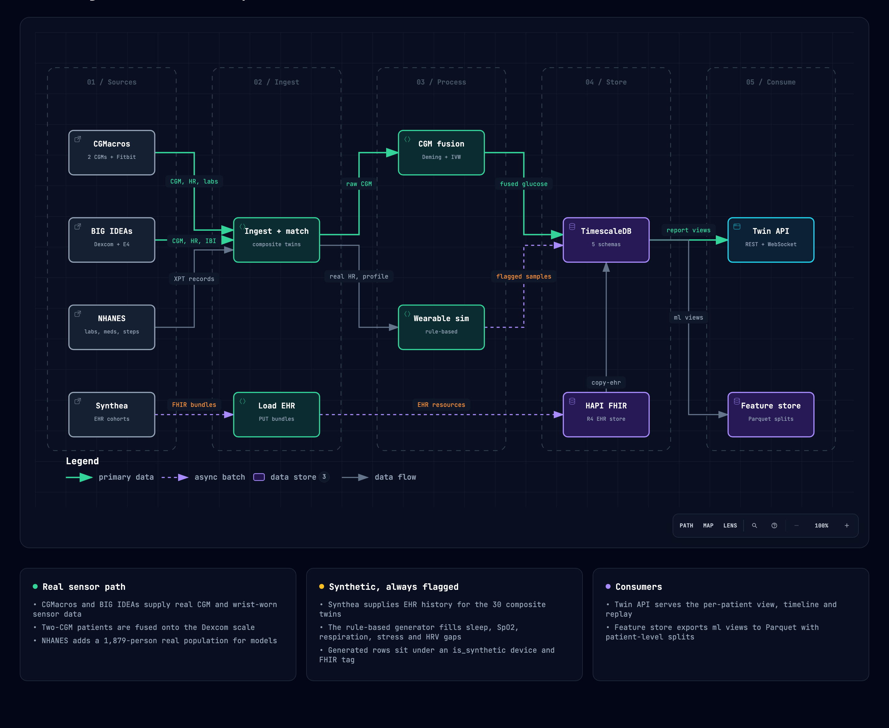

# Data dictionary

This file lists every column of every table and view, grouped by the kind of data a patient
has: identity, EHR, sensors, derived views, ML features and reference vocabularies.
For each group it also shows which cohort has the data, and whether it is **real** or **synthetic**.
Counts are from the current build (2026-10-04).

*Interactive version: [diagrams/data-pipeline.html](diagrams/data-pipeline.html) (archify, source in
[diagrams/data-pipeline.dataflow.json](diagrams/data-pipeline.dataflow.json)). How the synthetic parts
are made: [README → How the synthetic data is created](../README.md#how-the-synthetic-data-is-created).*

**Legend**
- **R** means real, measured in the source study.
- **S** means synthetic: Synthea EHR history, or the twin's rule-based wearable generator.
- **D** means derived in a view from other values. It counts as synthetic if any input is synthetic, and it carries an `*_is_synthetic` flag.
- **–** means not available.

| Cohort | People | Code in `ref.data_source` |
|---|---|---|
| CGMacros composite twins | 14 (T2D) | `cgmacros` (sensors, baseline labs) + `synthea` (EHR) + `twin_generator` |
| BIG IDEAs composite twins | 16 (prediabetes / elevated glucose) | `bigideas` (sensors, HbA1c) + `synthea` (EHR) + `twin_generator` |
| NHANES 2011–2014 | 1,879 (diabetes) | `nhanes` (everything) |

Every table that holds patient data references `core.patient.patient_id`, either directly or
through `core.device`. Every timestamp is a `timestamptz` in *twin time* (see `time_offset`).

---

## 1. Identity and demographics

### `core.patient`: one row per patient

| Column | Type | Meaning | CGMacros | BIG IDEAs | NHANES |
|---|---|---|---|---|---|
| `patient_id` | uuid PK | Synthea UUID, which is also the FHIR `Patient.id`, for composites; uuid5 of the NHANES SEQN otherwise | S | S | R |
| `mrn` | text | Medical record number | S | S | – |
| `given_name`, `family_name`, `name_prefix` | text | Name | S | S | – |
| `sex` | enum `female`/`male` | Sex; the match requires equality | R = S | R = S | R |
| `birth_date` | date | Date of birth | S | S | R (imputed) |
| `birth_date_imputed` | bool | True when only age is known and a mid-year date is used | false | false | true |
| `race_ethnicity` | text | Taken from the real participant when known, otherwise from Synthea | R | S | R |
| `address_city`, `address_state`, `address_postal` | text | Address | S | S | – |
| `source_id` | smallint → `ref.data_source` | Cohort the twin was built from | | | |
| `source_subject_id` | text | Subject id in the source, e.g. CGMacros `014` | R | R | R (SEQN) |
| `time_offset` | interval | Shift from source time to twin time, in whole days (original = time − offset) | ✓ | ✓ | 0 |
| `match_age_diff` | smallint | Age difference between participant and matched Synthea patient | ✓ | null (no age in source) | null |
| `match_bmi_diff` | numeric | BMI difference at the match | ✓ | null | null |
| `fhir_synced_at` | timestamptz | Last `reconcile` write to HAPI | ✓ | ✓ | – |
| `created_at`, `updated_at` | timestamptz | Audit timestamps | | | |

### `core.patient_tag`: many-to-many tags

| Column | Type | Meaning |
|---|---|---|
| `patient_id` | uuid → `core.patient` | |
| `tag_id` | smallint → `ref.tag` | |
| `assigned_by` | text | `pipeline` or the person who set it |
| `assigned_at` | timestamptz | When the tag was assigned |

Tags in use:

| Tag | Meaning |
|---|---|
| `composite-patient` | Real sensors and labs combined with a synthetic EHR |
| `synthetic-sensors` | Sleep, SpO₂, respiration, stress and/or HRV came from the generator |
| `gmi-inconsistent` | HbA1c and GMI differ by more than 1.0 (recomputed) |
| `gmi-warn` | HbA1c and GMI differ by more than 0.5 (recomputed) |
| `undiagnosed-diabetes` | NHANES lab-detected diabetes with no reported diagnosis |
| `demo-featured` | Set manually |
| `needs-review` | Set manually |

Tags are mirrored to FHIR `Patient.meta.tag`.

---

## 2. EHR (clinical records)

Every EHR row carries a `source_id`: `synthea` marks synthetic rows, and `cgmacros`, `bigideas` and `nhanes` mark real ones.

### 2.1 `core.observation`: labs, vitals, surveys, exams (long form)

| Column | Type | Meaning |
|---|---|---|
| `patient_id` | uuid → `core.patient` | |
| `code_id` | smallint → `ref.observation_code` | The LOINC code, which also gives the analyte, category and UCUM unit |
| `effective_at` | timestamptz | When the value was measured |
| `value_num` | numeric | Numeric value in the code's UCUM unit |
| `value_concept_id` | int → `ref.concept` | Coded value, e.g. smoking status (SNOMED) |
| `source_id` | smallint → `ref.data_source` | Where the row came from |
| `encounter_id` | uuid → `core.encounter` | The visit it was recorded at (from the FHIR resource's `encounter`; null for study data) |

The primary key is (`patient_id`, `code_id`, `effective_at`). Each row has exactly one of
`value_num` or `value_concept_id`.

**Every analyte, with availability.** Patient counts are shown where a cohort is not fully covered.
For example, "S (8)" means synthetic values exist for 8 of the 14 patients.

| Analyte | LOINC | Unit | CGMacros | BIG IDEAs | NHANES |
|---|---|---|---|---|---|
| **Glycaemia** | | | | | |
| `hba1c` | 4548-4 | % | **R** baseline + S history | **R** baseline + S history (12) | R (1,774) |
| `glucose_fasting` | 1558-6 | mg/dL | **R** | – | R (921) |
| `glucose` (serum/blood) | 2345-7, 2339-0 | mg/dL | S | S (12) | – |
| `insulin` | 20448-7 | u[IU]/mL | **R** | – | R (444) |
| `glucose_2h_postprandial` | 1521-4 | mg/dL | – | – | – |
| `c_peptide`, `c_peptide_2h_postprandial` | 1986-9, 95084-0 | ng/mL | – | – | – |
| `insulin_2h_postprandial` | 95114-5 | u[IU]/mL | – | – | – |
| `glucose_capillary` | 41653-7 | mg/dL | stored as fingersticks in `ts.glucose_reading` | – | – |
| `glycated_albumin` | 13873-5 | % | – | – | – |
| **Lipids** | | | | | |
| `cholesterol_total` | 2093-3 | mg/dL | **R** + S | S | R |
| `hdl` | 2085-9 | mg/dL | **R** + S | S | R |
| `triglycerides` | 2571-8 | mg/dL | **R** + S | S | R (898) |
| `ldl` | 13457-7, 18262-6, 2089-1 | mg/dL | S (D from real lipids in views) | S | R (863) |
| **Kidney and electrolytes** | | | | | |
| `creatinine` | 2160-0, 38483-4 | mg/dL | S | S (12) | R |
| `egfr_reported` | 33914-3, 98979-8 | mL/min/{1.73_m2} | S | S (5) | – (D: CKD-EPI 2021 in views) |
| `uacr` | 9318-7, 14959-1 | mg/g | S | – | R |
| `bun` | 3094-0, 6299-2 | mg/dL | S | S (12) | R |
| `sodium` | 2951-2, 2947-0 | mmol/L | S | S (12) | R |
| `potassium` | 2823-3, 6298-4 | mmol/L | S | S (12) | R |
| `uric_acid` | 3084-1 | mg/dL | – | – | R |
| **Liver, blood, cardiac** | | | | | |
| `alt` | 1742-6 | U/L | S (8) | S (5) | R |
| `ast` | 1920-8 | U/L | S (8) | S (5) | R |
| `ggt` | 2324-2 | U/L | – | – | R |
| `hemoglobin` | 718-7 | g/dL | S | S | – |
| `crp_hs`, `nt_probnp`, `troponin_t_hs` | 30522-7, 33762-6, 67151-1 | mg/L, pg/mL, ng/L | – | – | – |
| **Vital signs and body** | | | | | |
| `weight` | 29463-7 | kg | **R** + S | S | R |
| `height` | 8302-2 | cm | **R** + S | S | R |
| `bmi` | 39156-5 | kg/m2 | S (D from real weight and height) | S | D |
| `sbp`, `dbp` | 8480-6, 8462-4 | mm[Hg] | S | S | R |
| `heart_rate` (clinic) | 8867-4 | /min | S | S | – |
| `respiratory_rate` (clinic) | 9279-1 | /min | S | S | – |
| `heart_rate_resting` | 40443-4 | /min | – | – | – |
| `spo2` (clinic) | 59408-5 | % | – (wearable channel, see §3) | – | – |
| **Survey and exam (coded)** | | | | | |
| `smoking_status` | 72166-2 | SNOMED concept | S | S | R |
| `retinopathy_left`, `retinopathy_right` | 71490-7, 71491-5 | SNOMED concept | S (8) | – | – |
| **Activity summaries** | | | | | |
| `steps`, `sleep_duration` | 55423-8, 93832-4 | {steps}, min | daily FHIR summaries only (raw data in §3) | | |
| **CGM summary codes** | 97507-8, 106793-3, 97510-2, 104639-0 … 104642-4, 104638-2, 97506-0, 99504-3 | | used for FHIR summaries; values come from the fused CGM views | | |

Analytes marked "–" in every cohort are already defined in the vocabulary. They are reserved for
ShanghaiT2DM and AI-READI, so those sources load without schema changes.

### 2.2 `core.condition`

| Column | Type | Meaning |
|---|---|---|
| `patient_id` | uuid | |
| `concept_id` | int → `ref.concept` | SNOMED CT code, rolled up to a `ref.condition_group` |
| `onset_at` | timestamptz | Onset time |
| `abated_at` | timestamptz | Null while the condition is active |
| `source_id` | smallint | Where the row came from |
| `encounter_id` | uuid → `core.encounter` | The visit it was diagnosed at |

| | CGMacros | BIG IDEAs | NHANES |
|---|---|---|---|
| Conditions | S (765 rows) | S (580) | R, self-reported (5,477) |

Condition groups:
- t2d, prediabetes
- hypertension, dyslipidemia, obesity, metabolic_syndrome
- ckd, retinopathy, neuropathy, cardiovascular
- masld, hypoglycemia, anemia, sleep_apnea, copd

### 2.3 Medications

`core.medication_regimen` holds prescribed regimens as episodes:

| Column | Type | Meaning |
|---|---|---|
| `regimen_id` | serial PK | |
| `patient_id` | uuid | |
| `medication_id` | int → `ref.medication` | RxNorm **ingredient** RxCUI |
| `started_at`, `ended_at` | timestamptz | Episode period; `ended_at` is null while the regimen is active |
| `dose_value`, `dose_unit` | numeric, text | Dose per administration |
| `times_per_day` | numeric | Frequency |
| `as_needed` | bool | PRN flag |
| `source_id` | smallint | Where the row came from |
| `source_ref` | text | Source record id, e.g. the FHIR MedicationRequest id |
| `product_rxcui` | text → `ref.medication_product` (with `medication_id`) | The product prescribed (strength and form), e.g. "Warfarin Sodium 5 MG Oral Tablet" |
| `encounter_id` | uuid → `core.encounter` | The visit it was first prescribed at |

`core.medication_dose` holds timed administrations, such as insulin pen or pill logs. It is a hypertable-ready time series:

| Column | Type | Meaning |
|---|---|---|
| `patient_id` | uuid | |
| `medication_id` | int | RxNorm ingredient |
| `time` | timestamptz | Time of the dose |
| `dose_value`, `dose_unit` | numeric, text | Amount given |
| `route` | text | Route of administration |
| `source_id` | smallint | Where the row came from |

| | CGMacros | BIG IDEAs | NHANES |
|---|---|---|---|
| Regimens | S (166) | S (145) | R (9,869 prescriptions, 1,626 people) |
| Timed doses | – | – | – (planned: ShanghaiT2DM) |

Drug classes come from ATC. The 22 classes are:
- **Glucose-lowering:** biguanide, sulfonylurea, alpha-glucosidase inhibitor, thiazolidinedione, DPP-4 inhibitor, GLP-1 RA, SGLT2 inhibitor, other glucose-lowering, insulin (rapid, intermediate, premixed, long), oral combination.
- **Other:** statin, ACE inhibitor, ARB, calcium-channel blocker, thiazide, beta blocker, antiplatelet, vitamin K antagonist, systemic corticosteroid.

### 2.4 `core.encounter`

| Column | Type | Meaning |
|---|---|---|
| `encounter_id` | uuid PK | Synthea Encounter id |
| `patient_id` | uuid | |
| `encounter_class` | enum | `ambulatory`, `emergency`, `inpatient`, `virtual` or `home` |
| `started_at`, `ended_at` | timestamptz | Encounter period |
| `source_id` | smallint | Where the row came from |
| `type_concept_id` | int → `ref.concept` | What the visit was (SNOMED CT), e.g. "General examination of patient" |
| `reason_concept_id` | int → `ref.concept` | Why, when recorded, e.g. "Acute bronchitis" |

| | CGMacros | BIG IDEAs | NHANES |
|---|---|---|---|
| Encounters | S (902) | S (678) | – |

### 2.5 FHIR (HAPI, database `hapi`)

The full Synthea record of each composite twin is kept in HAPI, with resource ids equal to the Synthea ids. That record includes Patient, Encounter, Condition, Observation, MedicationRequest, Procedure, Immunization, CarePlan, Claim and more. On top of it the pipeline writes:
- **Patient:** `meta.tag` for each patient tag, plus the race/ethnicity extension.
- **Real baseline labs:** written as the newest Observations, tagged `composite-override`.
- **Device:** one resource for each device.
- **Daily summary Observations:**
  - CGM: mean 97507-8, time-in-ranges panel 106793-3, CV 104638-2, GMI 97506-0.
  - Mean heart rate 8867-4.
  - Steps 55423-8.
  - Sleep 93832-4 and SpO₂ 59408-5, tagged `synthetic-sensors`.

`core.*` is the analytics copy (`copy-ehr`). HAPI is the FHIR system of record.

---

## 3. Sensors

### 3.1 Devices: `core.device`

| Column | Type | Meaning |
|---|---|---|
| `device_id` | serial PK | Referenced by every reading |
| `patient_id` | uuid | Owner. A device belongs to exactly one patient |
| `model_id` | smallint → `ref.device_model` | |

Device models:

| Manufacturer | Model | Kind | Specimen | Interval | Synthetic | Used by |
|---|---|---|---|---|---|---|
| Dexcom | G6 Pro | cgm | interstitial | 5 min | no | CGMacros |
| Abbott | FreeStyle Libre Pro | cgm | interstitial | 15 min | no | CGMacros |
| Ascensia | Contour Next | glucometer | capillary | – | no | CGMacros (3 fingersticks per person) |
| Fitbit | Sense | wearable | – | 1 min | no | CGMacros |
| Dexcom | G6 | cgm | interstitial | 5 min | no | BIG IDEAs |
| Empatica | E4 | wearable | – | – | no | BIG IDEAs |
| ActiGraph | GT3X+ (wrist) | wearable | – | 1 min | no | NHANES |
| Twin generator | Garmin-like wearable (synthetic) | wearable | – | 1 min | **yes** | all 30 composites |
| Twin simulator | Live CGM (simulated) | cgm | interstitial | 5 min | **yes**, live | `twin simulate-stream` |
| Twin simulator | Live wearable (simulated) | wearable | – | 1 min | **yes**, live | `twin simulate-stream` |

Live-simulator models (`is_live_simulator`) carry readings streamed into the live twin. Only
`report.twin_latest` reads them; fusion, FHIR summaries, every other `report.*` view and the `ml.*`
feature store leave them out. `twin stream-reset` deletes these devices and their readings.

### 3.2 Glucose

`ts.glucose_reading` holds raw CGM and fingerstick readings. It is a hypertable, compressed by `device_id`.

| Column | Type | Meaning |
|---|---|---|
| `device_id` | int → `core.device` | |
| `time` | timestamptz | Native sample time; interpolated points are dropped |
| `glucose_mg_dl` | smallint | 20–600 mg/dL |

| | CGMacros | BIG IDEAs | NHANES |
|---|---|---|---|
| CGM | **R** Dexcom G6 Pro (40,010) + Libre Pro (14,639) | **R** Dexcom G6 (36,886) | – |
| Fingerstick | **R** Contour Next (42) | – | – |

`ts.glucose_fused` holds one calibrated 5-minute stream per patient. It is a hypertable.

| Column | Type | Meaning |
|---|---|---|
| `patient_id` | uuid | |
| `time` | timestamptz | On a 5-minute grid |
| `glucose_mg_dl` | numeric | Fused value on the Dexcom scale |
| `source` | enum | `both`, `reference_only` or `secondary_only` |
| `censored` | bool | True when the value sits at the 40/400 reporting limit and no other sensor value was available |

All 30 twins have a fused stream. The 14 CGMacros twins are fused from two CGMs; the 16 BIG IDEAs twins are a single-CGM pass-through.

`core.cgm_calibration` holds the fitted fusion parameters, one row per patient:

| Column | Type | Meaning |
|---|---|---|
| `patient_id` | uuid PK | |
| `method_version` | text | `cgm-fusion-1` |
| `reference_model_id`, `secondary_model_id` | smallint → `ref.device_model` | Dexcom, Libre. The secondary is null for single-CGM patients |
| `lag_minutes` | smallint | Cross-correlation lag between the two sensors |
| `lag_kind` | enum | `sensor_lag` (≤ 20 min) or `clock_offset` |
| `reference_shift_minutes`, `secondary_shift_minutes` | smallint | Shift applied to each device |
| `secondary_intercept`, `secondary_slope` | numeric | Deming mapping of Libre onto the Dexcom scale |
| `overlap_points` | int | Paired points used for the fit |
| `disagreement_sd` | numeric | SD of the residual disagreement |
| `warmup_variance_factor` | numeric | Down-weighting factor for the first 24 h of a sensor |
| `fitted_at` | timestamptz | When the fit ran |

The secondary columns are either all null or all set.

### 3.3 Wearables: `ts.wearable_sample` (hypertable, long form)

| Column | Type | Meaning |
|---|---|---|
| `device_id` | int → `core.device` | The device's model tells real from synthetic (`is_synthetic`) |
| `metric_id` | smallint → `ref.wearable_metric` | |
| `time` | timestamptz | |
| `value` | numeric | In the metric's unit |

| Metric | Unit | CGMacros | BIG IDEAs | NHANES |
|---|---|---|---|---|
| `heart_rate` | /min | **R** Fitbit, per minute (14) | **R** E4, per-minute mean (16) | – |
| `ibi_ms` (inter-beat interval) | ms | – | **R** E4, every beat (4.1 M rows) | – |
| `skin_temp` | Cel | – | **R** E4, per-minute mean of 4 Hz | – |
| `eda` | uS | – | **R** E4, per-minute mean of 4 Hz | – |
| `mets` | {MET} | **R** Fitbit (10 of 14) | – | – |
| `activity_level` (0–3) | {level} | **R** Fitbit (4 of 14) | – | – |
| `active_kcal` | kcal | **R** Fitbit (14) | – | – |
| `steps` | {steps} | – | – | **R** ActiGraph wrist, per minute (1,607) |
| `wear_minutes` | min | – | – | **R** daily total (1,607) |
| `spo2` | % | **S** each minute asleep, every 15 min awake | **S** | – |
| `respiration_rate` | /min | **S** each worn minute | **S** | – |
| `stress` | {score} 0–99 | **S** every 3 min awake | **S** | – |
| `hrv_rmssd` (nightly) | ms | **S** one value per night | – (D: real, from `ibi_ms`) | – |

### 3.4 Sleep: `ts.sleep_segment`

| Column | Type | Meaning |
|---|---|---|
| `device_id` | int | |
| `start_time`, `end_time` | timestamptz | Segment period |
| `stage` | enum | `awake`, `light`, `deep` or `rem` |

Sleep segments are **S** for all 30 composite twins (6,310 segments). No source cohort recorded sleep.

### 3.5 Live twin: `ts.twin_state_transition` (hypertable)

A status change the live twin published (twin.streaming). The readings that caused it are in the
tables above.

| Column | Type | Meaning |
|---|---|---|
| `patient_id` | uuid → `core.patient` | |
| `signal` | enum | `glucose` (band), `glucose_trend`, `heart_rate` (band), `activity` (level), `sleep` (stage), `spo2` (band) |
| `time` | timestamptz | Device time of the reading, or of the staleness check, that caused the change |
| `from_status`, `to_status` | text | For example `in_range` → `high`, `normal` → `stale`. `from_status` is null for the first status |
| `value` | numeric | The signal's value at the change |
| `state_version` | bigint | The twin state version that published it (restarts when the API restarts) |

### 3.6 Continuous aggregates (`ts.*`, real-time)

| Aggregate | Columns |
|---|---|
| `ts.glucose_daily` | device_id, day, n, mean, sd, n_very_low, n_low, n_target, n_high, n_very_high |
| `ts.glucose_fused_daily` | patient_id, day, n, mean, sd, n_very_low, n_low, n_target, n_high, n_very_high |
| `ts.wearable_daily` | device_id, metric_id, day, n, total, mean, min, max |

---

## 4. Derived views (`report.*`)

These views are read-only and computed on demand. They prefer real values over synthetic ones and flag anything synthetic.

| View | Grain | Columns |
|---|---|---|
| `patient_summary` | patient | patient_id, display_name, mrn, name_prefix, given_name, family_name, sex, birth_date, birth_date_imputed, age, race_ethnicity, address_city, address_state, source, source_subject_id, tags |
| `patient_baseline` | patient | patient_id, effective_at, hba1c, fasting_glucose, glucose_2h_postprandial, insulin, c_peptide, total_cholesterol, hdl, triglycerides, weight_kg, height_cm, sbp, dbp, creatinine, uacr, alt, ast, uric_acid, smoking_status, **bmi**, bmi_is_synthetic, **non_hdl**, **tc_hdl_ratio**, **vldl**, **ldl** (Friedewald), ldl_is_synthetic, **homa_ir**, homa_ir_is_synthetic, **egfr** (CKD-EPI 2021), egfr_is_synthetic, **cohort** (`normal` / `prediabetes` / `t2d` from HbA1c), synthetic_analytes |
| `observation_latest` | patient × analyte | patient_id, analyte, loinc, category, effective_at, value_num, value_display, ucum_unit, source, is_synthetic |
| `patient_conditions` | patient × condition group | patient_id, condition_group, first_onset, active, conditions, all_synthetic |
| `medication_regimen` | regimen | patient_id, regimen_id, rxcui, medication, product_rxcui, **product**, drug_class, drug_class_display, glucose_lowering, started_at, ended_at, active, dose_value, dose_unit, times_per_day, as_needed, encounter_id, source, is_synthetic |
| `condition_episode` | condition episode | patient_id, concept_id, system, code, **display** (SNOMED tag stripped), **kind** (`diagnosis` / `finding`), condition_group, condition_group_display, onset_at, abated_at, active, encounter_id, source, is_synthetic |
| `observation_result` | result | patient_id, analyte, loinc, loinc_display, category, effective_at, value_num, value_text, ucum_unit, encounter_id, source, is_synthetic |
| `visit` | encounter | patient_id, encounter_id, encounter_class, **type**, **reason**, started_at, ended_at, source, is_synthetic |
| `cgm_daily` | patient × day (fused) | patient_id, day, n, coverage_pct, mean_mg_dl, cv_pct, gmi, pct_very_low, pct_low, pct_target, pct_high, pct_very_high |
| `cgm_window` | patient | patient_id, glucose_source, method_version, period_start, period_end, n, mean_mg_dl, gmi |
| `cgm_device_daily` | patient × device × day (raw) | patient_id, day, device_id, device_model, n, coverage_pct, mean_mg_dl, cv_pct, gmi, pct_very_low … pct_very_high |
| `cgm_device_window` | patient × device | patient_id, device_id, device_model, period_start, period_end, n, mean_mg_dl, gmi |
| `consistency` | patient | patient_id, hba1c, gmi, mean_mg_dl, glucose_source, abs_diff, status (`ok` / `warn` / `inconsistent`) |
| `activity_daily` | patient × day | patient_id, day, steps, hr_mean, hr_min, hr_max, hr_minutes, wear_minutes, met_minutes, active_kcal, activity_level_mean, spo2_mean, respiration_mean, stress_mean, skin_temp_mean, eda_mean, synthetic_metrics |
| `sleep_nightly` | patient × night | patient_id, night, bedtime, wake_time, time_in_bed_min, asleep_min, light_min, deep_min, rem_min, awake_min, efficiency_pct, is_synthetic |
| `spo2_nightly` | patient × night | patient_id, night, sleep_minutes, spo2_mean, spo2_min, t90_pct, odi_per_hour, is_synthetic |
| `hrv_nightly` | patient × night | patient_id, night, rmssd_ms, beats, is_synthetic (real = RMSSD of artefact-free `ibi_ms` beats before 05:00, ≥ 300 beats) |
| `sensor_window` | patient | patient_id, window_start, window_end (real devices only) |
| `replay_stream` | event | patient_id, time, kind (`glucose`, `glucose_fused`, `activity`, `sleep`, `medication`), source, payload (jsonb). Recorded devices only |
| `twin_latest` | patient × metric | patient_id, device_id, metric (`glucose`, `sleep` or a wearable metric code), time, value_num, value_text (sleep stage), until, unit, source, is_live. Live-simulator readings win; otherwise the latest at or before now. Glucose comes from the fused stream unless a live CGM has data |

---

## 5. ML feature store (`ml.*` → `data/features/*.parquet`)

Every table has a `split` column (`train`, `val` or `test`): a hash of `patient_id` split 70/15/15, stable across rebuilds.

### `ml.patient_static`: one row per patient (1,909 × 59)

| Group | Columns |
|---|---|
| Identity | patient_id, cohort, split, sex, age, race_ethnicity |
| Diabetes | diabetes_diagnosed, diabetes_duration_years, hba1c, fasting_glucose, insulin, c_peptide, homa_ir, homa_ir_is_synthetic |
| Body and BP | weight_kg, height_cm, bmi, bmi_is_synthetic, sbp, dbp |
| Lipids | total_cholesterol, hdl, ldl, ldl_is_synthetic, triglycerides |
| Kidney and liver | creatinine, egfr, egfr_is_synthetic, uacr, alt, ast, uric_acid |
| Lifestyle | smoking_status |
| Conditions | has_hypertension, has_dyslipidemia, has_ckd, has_retinopathy, has_neuropathy, has_cardiovascular, has_sleep_apnea, has_copd |
| Medications | on_metformin, on_sulfonylurea, on_dpp4i, on_sglt2i, on_glp1ra, on_tzd, on_insulin, on_statin, on_acei_arb, n_glucose_lowering_classes |
| Data availability | cgm_days, valid_step_days, steps_per_valid_day, hr_days, sleep_nights, sleep_synthetic, real_hrv_nights, has_synthetic_values |

### `ml.patient_day`: one row per patient-day (14,321 × 39)

| Group | Columns |
|---|---|
| Key | patient_id, day, split |
| CGM (fused) | cgm_coverage_pct, glucose_mean, glucose_cv_pct, gmi, pct_very_low, pct_low, pct_target, pct_high, pct_very_high |
| Activity | steps, wear_minutes, met_minutes, active_kcal, activity_level_mean |
| Heart | hr_mean, hr_min, hr_max, hr_minutes |
| Wrist physiology | stress_mean, respiration_mean, spo2_day_mean, skin_temp_mean, eda_mean |
| Previous night | sleep_prev_night_min, deep_prev_night_min, rem_prev_night_min, sleep_efficiency_pct, spo2_sleep_mean, spo2_sleep_min, t90_pct, odi_per_hour, hrv_rmssd_prev_night, hrv_is_synthetic |
| Medication | n_glucose_lowering_classes, insulin_units |
| Provenance | synthetic_channels |

### `ml.series_5min`: one row per patient per 5 minutes (80,567 × 22 for the 30 twins)

| Group | Columns |
|---|---|
| Key | patient_id, time |
| Glucose | glucose_mg_dl, glucose_sources, glucose_censored |
| Activity and heart | steps, heart_rate, met_minutes, activity_level, rmssd_5min (real IBI only) |
| Wrist physiology | spo2, respiration_rate, stress, skin_temp, eda, sleep_stage |
| Medication | insulin_fast_units, insulin_basal_units, oral_doses |
| Provenance | synthetic_channels |
| Labels (Parquet only) | glucose_t30, glucose_t60 |

`ml.patient_split` maps patient_id to split.

---

## 6. Reference vocabularies (`ref.*`)

| Table | Columns | Rows |
|---|---|---|
| `ref.data_source` | source_id, code, name, url, license, is_synthetic, access_tier (`open` / `registered` / `controlled` / `generated`) | 7 |
| `ref.tag` | tag_id, code, display, description, fhir_system | 7 |
| `ref.observation_code` | code_id, loinc, display, analyte, category (`laboratory` / `vital-signs` / `activity` / `survey` / `exam`), value_type (`numeric` / `coded`), ucum_unit | 61 LOINC codes |
| `ref.condition_group` | group_id, code, display | 15 |
| `ref.concept` | concept_id, system, code, display, condition_group_id | SNOMED CT codes seen in the data |
| `ref.drug_class` | class_id, code, display, atc_prefix, glucose_lowering | 22 |
| `ref.medication` | medication_id (RxNorm ingredient RxCUI), name, drug_class_id | 489 |
| `ref.medication_atc` | medication_id, atc4 | 703 |
| `ref.medication_product` | product_rxcui, medication_id, display, strength_value, strength_unit | 188 |
| `ref.wearable_metric` | metric_id, code, display, unit, loinc | 13 |
| `ref.device_model` | model_id, manufacturer, model_name, kind (`cgm` / `glucometer` / `wearable`), specimen, nominal_interval, is_synthetic, is_live_simulator | 10 |

The seeds are in [seeds/reference/](../seeds/reference/) and the mappings in [seeds/mappings/](../seeds/mappings/).

---

## 7. One patient at a glance

Everything known about one composite twin:

| Layer | What exists | Real or synthetic |
|---|---|---|
| Identity | name, MRN, birth date, address (Synthea); sex and race (real) | mixed, see §1 |
| Baseline labs | CGMacros: HbA1c, fasting glucose, insulin, lipids, weight, height. BIG IDEAs: HbA1c | **R** |
| Lab and vital history | years of HbA1c, lipids, kidney panel, BP, BMI | S |
| Conditions, medications, encounters | T2D or prediabetes, comorbidities, regimens, visits | S |
| CGM | ~10 days raw, plus the fused 5-minute stream | **R** |
| Heart and activity | HR (both cohorts); METs and kcal (CGMacros); IBI, skin temperature and EDA (BIG IDEAs) | **R** |
| Sleep, SpO₂, respiration, stress | every night and day of the sensor window | S (generator) |
| Nightly HRV | BIG IDEAs: computed from real beats. CGMacros: generated | R / S |
| Timed medication doses | none yet | – |

The API returns the same picture: `GET /twin/{patient_id}`, with a `provenance` block that lists
`synthetic_analytes` and `synthetic_sensor_channels`.
